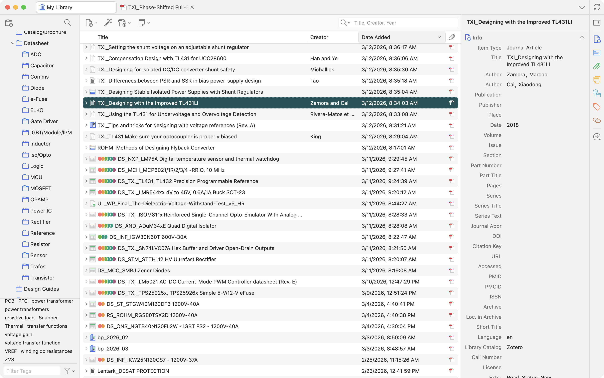

import Adm from "../../components/Adm.astro";

There's software out there, developed and maintained for years by a couple of people with no interest in your data or anything like that. And every time you use it, you're amazed by how well-thought-out it is, how much it makes your life easier. [Zotero](https://zotero.org) is one of them.

<Adm type="info">
I'm not affiliated with Zotero in any way. This post is purely out of amazement, and I just wanted to share my workflow around it.
</Adm>

## What is Zotero and why use it?

At its core, Zotero is built to manage and organize your reading and references for your research. Researchers, scientists, and people alike generally spend a good amount of their time reading publications in their field. You're working on a subject, an experiment, or an idea, and you're constantly exposed to new and old papers, journal articles, dissertations, application notes, and the like. Over time, your database grows bigger and bigger, and when you want to cite something from it, retrieving the right information can become extraordinarily difficult if you're not an organized person.

This database is mostly text, but alongside the documents themselves comes a lot of metadata: DOI[^x], publisher, author information, where the paper was published, when it was published, when you accessed it. The list goes on. For a handful of documents, dumping everything into a folder and encoding information into filenames is probably fine. But when you're dealing with hundreds of them, especially as you advance in your career, that folder becomes bloated and nearly impossible to manage. I've seen colleagues constantly renaming files after reading them, appending things like "_1stPass" or the publication date and journal name to the filename, and in doing so, breaking any links or shared references they had with collaborators.

File systems aren't designed for metadata management at their core. There is some file metadata at the OS level, but it's basic and mostly OS-centric: modification time, creation date, that sort of thing. Not particularly useful unless you're actively building around it in your file manager.

To solve these problems and create logical connections and filters across documents, people built document managers. There are many of them out there. What they do, at their core, is manage metadata and, more importantly, let you define your own custom fields so you can build your own system around them.

Zotero is a document manager with tagging and metadata management capabilities, and on top of that, since it's built for academics, it has automatic retrieval features: add a paper by its DOI and it pulls the metadata and abstract for you automatically.

[^x]: DOI, digital object identifier, is an identification number in the academic system.
